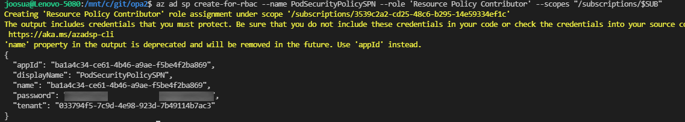

# Azure Kubernetes Service - Enhanced Kubernetes cluster pod security baseline standards for Linux-based workloads

Builds upon existing Pod Security baseline with enhancements, and provides means to manage the initiative as code using GitHub actions.
(You can also create manually the initiative, but this guide does not have instructions for manual workflow)

---

**Differences compared to the built-in initiative:**


✔️ Adds "debug" namespace to exclusions, so you don't have to run debugging workloads in the namespaces  ``["kube-system" "gatekeeper-system", "azure-arc"] ``

- Typical example of debug namespace use would be the SSH to AKS node

```bash
kubectl create namespace 'debug'
node=$(kubectl get nodes -o=jsonpath='{.items[0].metadata.name}')
val=$(echo $node | sed 's/"//g')
kubectl debug node/$val -it --image=mcr.microsoft.com/aks/fundamental/base-ubuntu:v0.0.11 --namespace="debug"
```

✔️ Adds ``Kubernetes cluster containers should only use allowed AppArmor profiles`` -policy 

- Configuration is compliant with the "runtime/default" out-of-the-box AKS node installed profile. Creates initiative parameter for "runtime/default" appArmor profile, which is the default profile installed in AKS nodes

✔️ Adds  `` Kubernetes cluster containers should run with a read only root file system `` 

---

## Utilizing the initiative 

- Target the Policy to scope you want to apply it (Recommendation for testing is to target it to single AKS cluster)
- Review audit results produced by the policy
- Implement healthy podSpec / deployment 


### Example of healthy podspec
- For testing replace the image with any image you want to test the POD deployment against
- The example assumes keyVault integration with secrets store driver. If you don't have such integration configured, remove ``volumes`` and ``volumeMounts``  

```YAML
apiVersion: v1
kind: Pod
metadata:
  name: demorce
  annotations:
    container.apparmor.security.beta.kubernetes.io/v5: runtime/default
spec:
  automountServiceAccountToken: false
  containers:
    - name: v5
      image: acraksa.azurecr.io/v5rce:latest
      ports:
        - containerPort: 8443
      resources:
          limits:
            cpu: 100m
            memory: 250Mi
      securityContext:
        privileged: false
        readOnlyRootFilesystem: true
        allowPrivilegeEscalation: false
        runAsNonRoot: true
        runAsUser: 1000
      volumeMounts:
        - name: secrets-store01-inline
          mountPath: /mnt/secrets-store
          readOnly: true
  volumes:
      - name: secrets-store01-inline
        csi:
          driver: secrets-store.csi.k8s.io
          readOnly: true
          volumeAttributes:
            secretProviderClass: azure-kvname-user-msi 
``` 


## Deployment guide:

### Express installation with password based SPN (recommended only for testing)

Following this method creates SPN with required permissions ``Resource Policy Contributor``  to the subscription defined in cli script

- References https://github.com/marketplace/actions/manage-azure-policy#configure-credentials-for-azure-login-action 
1.  Create SPN

```bash
## Set subscription
SUB="3539c2a2-cd25-48c6-b295-14e59334ef1c"
az account set --subscription $SUB
az ad sp create-for-rbac --name PodSecurityPolicySPN --role 'Resource Policy Contributor' --scopes "/subscriptions/$SUB"

# If you are running Azure Cloud Shell, you can automatically do step 2 here 
# node replacesub.js $SUB
```

Take note of the output, as it is used in step 5.



2. Replace subscription ``SUBID`` ID in [policyset.json](initiatives/AKSREF_-_Kubernetes_cluster_pod_security_baseline_standards_for_Linux-based_workloads_1f01afd98f33414e995e3ad5/policyset.json)
  ```
    "id": "/subscriptions/SUBID/providers/Microsoft.Authorization/policySetDefinitions/1f01afd98f33414e995e3ad5",
    "type": "Microsoft.Authorization/policySetDefinitions",
    "name": "1f01afd98f33414e995e3ad5"
  ```


3. After this Create **new** Github repo, and force push the contents of this repo to the just created repo

```
 git remote add myTestRepo git@github.com:you/yourTestRepo.git
 git add .; git commit -m "init to myTestRepo"
 git push myTestRepo --force
```

4. replace the credentials in action.yml wit the secret listed in the throwaway repo *(the ID for credential needs to match that of the one listed in secrets)*
```yaml
with:
        creds: ${{secrets.policySecret}}
        allow-no-subscriptions: true
```
5. Add the password to the repo you created. The secret name needs to match "creds" as defined in previous step

- replace as follows AppId = clientID, password = clientSecret


6. From actions start the workflow manually

### Advanced with Workload federation (recommended for enterprise use)

- This is production use example


## References
https://kubernetes.io/docs/concepts/policy/pod-security-policy/
